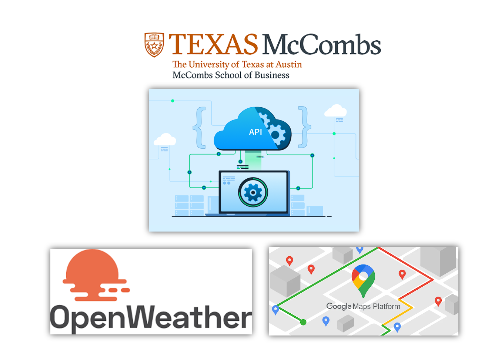
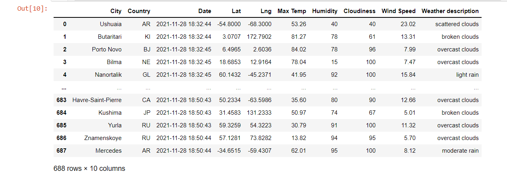
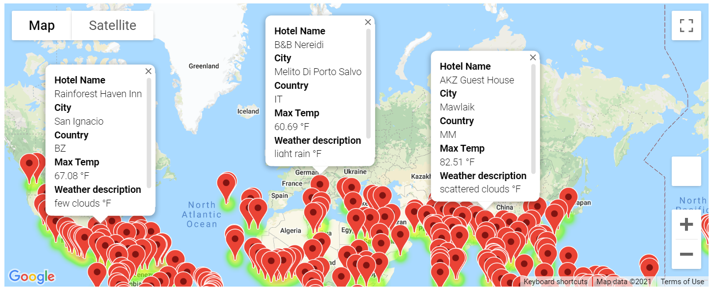
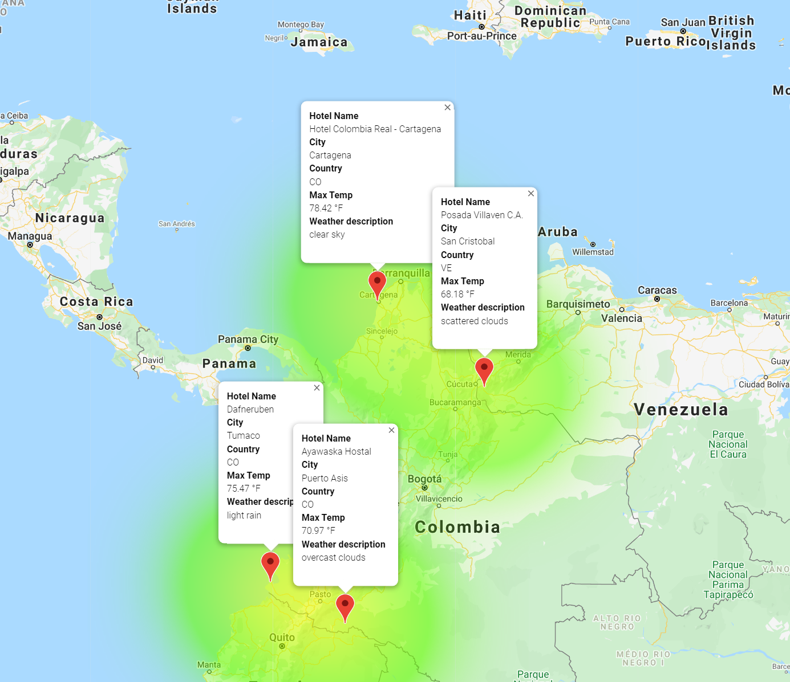
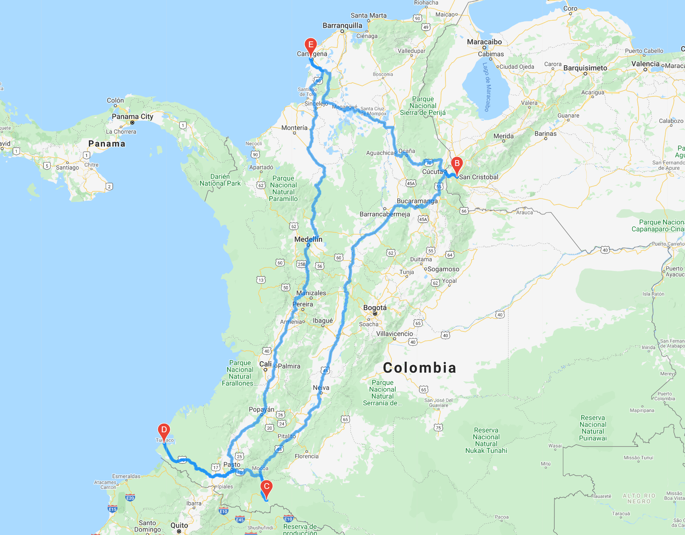

#WeatherPY Analysis, PlanMyTrip app

## 1. Overview of the analysis

This is the challenge activity for the module 7 of the Data Analytics and Visualization Boot Camp of the university of Texas at Austin.
The main idea is to apply the learned skills of Application Programming Interface (APIs)

The project  was based on data of that was obtained  using APIs from Open Weather ang Google Maps
The objectives for this challenge were: to get weather conditions of some latitudes and longitudes that were generated randomly, get the weather conditions and the nearest hotel.
Them based on  user’s weather preferences we are able to see each location in a map with a pop-up window with the data, and finally  generate a map with the suggested route for 4  cities
The 

## 2. Results:

###Deliverable 1: Retrieve Weather Data

 

A data frame was generated with 688 cities where we can see data such as

-	City
-	Country
-	Date
-	Latitude
-	Longitude
-	Max temp
-	Humidity
-	Cloudiness
-	Wind speed
-	Weather description

### Deliverable 2 Create a Customer Travel Destinations Map

  
  
I used input statements to retrieve customer weather preferences, 
then use those preferences to identify potential travel destinations and nearby hotels. 
Then, show those destinations on a marker layer map with pop-up markers.

### Deliverable 3 Create a Travel Itinerary Map
I used the Google Directions API to create a travel itinerary that shows the route between four cities chosen from the customer’s possible travel destinations.
Then, create a marker layer map with a pop-up marker for each city on the itinerary.

## 3. Summary: 

This was a  very interesting challenge where I had the opportunity to discover and use the APIs.
I see a big opportunity and I believe this will be very useful 

